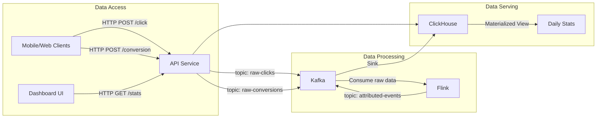

# Ad Click Aggregator
This project is a proof of concept for an ad click aggregator. It is a web application that aggregates ad clicks from multiple sources and provides a single interface for users to click on ads.

## Features
- Receiving click and conversion data
- Attribution logic with 24 hours lookback window
- Deduplication, prevent double counting of conversion
- Real time reporting of clicks, conversion, value, and conversion rate (CVR) on daily, weekly, and monthly bases
- High write thoughtput, low read latency for analytics

## Tech Stack
- Java Spring Boot (Webflux) for Ingestion API
- Apache Kafka as message broker
- Apache Flink for stateful processing for complex attribution logic
- Clickhouse for analytic Database

## Architecture

