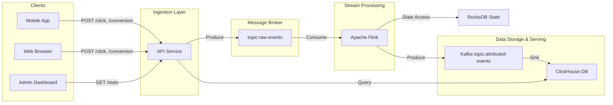

# System Design: Ad Click Aggregator

## 1. Introduction
The Ad Click Aggregator is a high-throughput, low-latency system designed to ingest, process, and analyze ad interaction data. It tracks user clicks and subsequent conversions (e.g., purchases, sign-ups) to attribute conversions to specific ads. The system provides real-time analytics to advertisers and publishers.

## 2. Requirements

### 2.1 Functional Requirements
*   **Event Ingestion**: The system must accept high volumes of `click` and `conversion` events via HTTP API.
*   **Attribution**: Match `conversion` events to the most recent `click` event for the same user within a 24-hour lookback window.
*   **Deduplication**: Ensure conversions are not double-counted if sent multiple times.
*   **Reporting**: Provide real-time aggregated statistics (Clicks, Conversions, Value, CVR) sliced by time (Daily, Weekly, Monthly).

### 2.2 Non-Functional Requirements
*   **High Throughput**: Handle thousands of events per second.
*   **Low Latency**: Ingestion response time < 50ms; Analytics query response time < 1s.
*   **Scalability**: Horizontally scalable components to handle traffic spikes.
*   **Reliability**: At-least-once processing guarantee; Data durability.
*   **Extensibility**: Easy to add new attribution models or event types in the future.

## 3. System Architecture

### 3.1 High-Level Diagram



### 3.2 Component Details

#### **API Service (Spring Boot Webflux)**
*   **Role**: Entry point for all data.
*   **Tech**: Java, Spring Boot Webflux.
*   **Responsibility**: 
    *   Validate incoming payloads.
    *   Produce events to Kafka `raw-events` topic asynchronously.
    *   Serve analytics API by querying ClickHouse.
*   **Scalability**: Stateless; scales horizontally behind a Load Balancer.

#### **Message Broker (Apache Kafka)**
*   **Role**: Buffer and decouple ingestion from processing.
*   **Topics**:
    *   `raw-events`: Contains both clicks and conversions. Partitioned by `user_id` to ensure ordering for Flink processing.
    *   `attributed-events`: Contains fully attributed conversion events enriched with click metadata.

#### **Stream Processing (Apache Flink)**
*   **Role**: Stateful event processing.
*   **Logic**:
    *   **KeyBy**: `user_id`.
    *   **State**: Store the latest `click` event for each user in `ValueState`.
    *   **Process**:
        *   On `click`: Update state with new click data.
        *   On `conversion`: Check state. If a click exists within 24 hours, emit an `attributed-event`.
    *   **Deduplication**: Store transaction IDs of processed conversions in `MapState` (with TTL) to prevent duplicates.

#### **Analytics Database (ClickHouse)**
*   **Role**: OLAP storage for high-speed reporting.
*   **Tables**:
    *   `events_local`: MergeTree engine for raw storage.
    *   `events_distributed`: Distributed table for cluster support.
    *   `daily_stats_mv`: Materialized View for pre-aggregating data.

## 4. Data Model

### 4.1 Kafka Event Schemas

**Click Event**
```json
{
  "event_type": "click",
  "event_id": "uuid-v4",
  "user_id": "user-123",
  "ad_id": "ad-456",
  "campaign_id": "camp-789",
  "source": "facebook", 
  "timestamp": 1678886400000,
  "metadata": { "browser": "Chrome", "geo": "US" }
}
```

**Conversion Event**
```json
{
  "event_type": "conversion",
  "event_id": "uuid-v4",
  "user_id": "user-123",
  "type": "purchase",
  "value": 19.99,
  "source": "ios_app",
  "timestamp": 1678890000000
}
```

**Attributed Event (Output of Flink)**
```json
{
  "event_type": "attributed_conversion",
  "conversion_id": "uuid-v4",
  "click_id": "uuid-v4",
  "user_id": "user-123",
  "ad_id": "ad-456",
  "campaign_id": "camp-789",
  "source": "facebook",
  "conversion_type": "purchase",
  "value": 19.99,
  "click_time": 1678886400000,
  "conversion_time": 1678890000000,
  "attribution_window_hours": 24
}
```

### 4.2 ClickHouse Schema & Concepts

**Why ClickHouse?**
ClickHouse is a column-oriented database, meaning it stores data by columns rather than rows. This makes it incredibly fast for analytics because queries only read the specific columns they need (e.g., just `value` and `campaign_id`), skipping the rest.

**Schema Design**

1.  **`attributed_events` (The Raw Data)**
    *   **Engine: `MergeTree`**: This is the standard engine. It's designed for high-speed insertion. Data is written in parts and merged in the background.
    *   **`ORDER BY`**: Crucial for performance. We order by `campaign_id` and `ad_id` so that queries filtering by these fields are lightning fast (it acts like a primary key index).

```sql
CREATE TABLE attributed_events (
    conversion_id UUID,
    click_id UUID,
    user_id String,
    ad_id String,
    campaign_id String,
    source String,
    conversion_type LowCardinality(String), -- Optimization for low-cardinality strings
    value Decimal(18, 2),
    click_time DateTime,
    conversion_time DateTime
) ENGINE = MergeTree()
PARTITION BY toYYYYMMDD(conversion_time) -- Splits data by day on disk for easy management
ORDER BY (campaign_id, ad_id, conversion_time);
```

2.  **`daily_stats_mv` (The Pre-Aggregation)**
    *   **Concept**: A Materialized View in ClickHouse is like a real-time trigger. Whenever data is inserted into `attributed_events`, ClickHouse *automatically* calculates the partial sums and inserts them into this view.
    *   **Engine: `SummingMergeTree`**: This engine automatically adds up the `count()` and `sum(value)` for rows with the same sorting key (`campaign_id`, `source`, `day`, etc.) during background merges.
    *   **Benefit**: Instead of querying millions of raw rows, the API queries this much smaller table.

```sql
CREATE MATERIALIZED VIEW daily_stats_mv
ENGINE = SummingMergeTree()
PARTITION BY toYYYYMMDD(day)
ORDER BY (campaign_id, source, conversion_type, day)
AS SELECT
    toStartOfDay(conversion_time) as day,
    campaign_id,
    source,
    conversion_type,
    count() as total_conversions,
    sum(value) as total_revenue
FROM attributed_events
GROUP BY day, campaign_id, source, conversion_type;
```

## 5. API Design

### 5.1 Ingestion
*   `POST /api/v1/events`
    *   Body: JSON payload (Click or Conversion).
    *   Response: `202 Accepted`.

### 5.2 Reporting
*   `GET /api/v1/stats`
    *   **Parameters**:
        *   `start_date` (required): YYYY-MM-DD
        *   `end_date` (required): YYYY-MM-DD
        *   `campaign_id` (optional): Filter by specific campaign.
        *   `interval` (optional, default=`daily`): `daily`, `weekly`, `monthly`.
    
    *   **How it works with ClickHouse**:
        *   **Daily**: Query `daily_stats_mv` directly.
        *   **Weekly/Monthly**: Query `daily_stats_mv` and `GROUP BY` week/month. Since `daily_stats_mv` is already small, this is instant.

    *   **Response**:
```json
{
  "interval": "daily",
  "data": [
    {
      "date": "2023-03-15",
      "campaign_id": "camp-789",
      "source": "facebook",
      "clicks": 1500,
      "conversions": 50,
      "revenue": 999.50,
      "cvr": 0.033
    }
  ]
}
```

## 6. Scalability & Reliability

*   **Kafka**: Partitioning by `user_id` ensures that all events for a user go to the same partition, allowing Flink to process them in order and maintain correct state.
*   **Flink**: Checkpointing is enabled to save state to a distributed file system (e.g., S3/HDFS). In case of failure, Flink recovers from the last checkpoint.
*   **ClickHouse**: Column-oriented storage allows for extremely fast aggregations over millions of rows. Materialized views pre-calculate common metrics to further reduce query latency.
